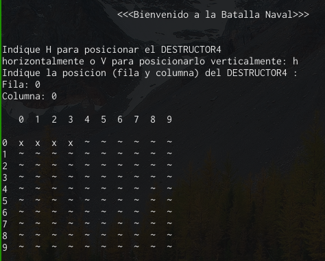
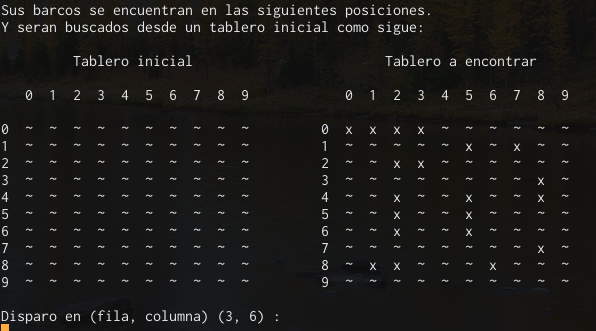

# Batalla Naval

## Primer parcial de Algoritmos y Estructuras de Datos

En este trabajo práctico se utilizó programación orientada a objetos haciendo incapié en diferentes estructuras de datos - *pilas*, *colas*, *listas enlazadas* para la creación de un juego de batalla naval usando una interfaz basada en texto (TUI)

### Un menú interactivo permite ir ubicando los barcos en el tablero.

### Comienza el juego una vez se terminan de posicionar los barcos.

